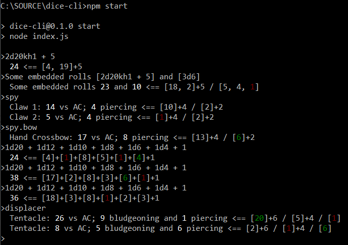

# dice-cli

This is a command line interface for the [rpg-dice-roller](https://github.com/dice-roller/rpg-dice-roller) library.

They have their own [general CLI](https://github.com/dice-roller/cli) but I wanted to make one that was more tailored to my needs.

When running game sessions, I need
- To roll multiple sets at once (eg. attack and damage rolls)
- To identify at a glance the result value and if it was a minimum or maximum roll
- To have macros that allow me to quickly make multiple rolls

## Differences

dice-roller/cli
- Instantiate script for each roll
- Format result as "[Notation]: [Rolls] = [Result]"
```console
> roller 2d20kh1+5
2d20kh1+5: [18d, 20]+5 = 25
> roller 1d20+2
1d20+2: [13]+2 = 15
> roller 2d6+4
2d6+4: [1, 4]+4 = 9
```

dice-cli:
- Instantiate script once, then roll multiple times
- Format result as "[Result] <== [Rolls]"
- Colorize the output (bold for result, green for max rolls, red for min rolls)
- Allow multiple role notations to be embedded in a string using `[]`
- Allow for macros to be defined both in a checked in macros.json and a local macrosCustom.json



## Usage

- Clone this repo
- Run `npm install` to install dependencies
- Run `npm start` to start the CLI

Commands
- cls, clear: clear the console
- exit: exit the program
- help: show this help message
- list: list all macros
- reload, refresh: reload macros
- [anything else]: roll the dice

Roll Using
- A string in rpg-dice-roller [notation](https://dice-roller.github.io/documentation/guide/notation/)
  - `> 1d20+2`
- A string with multiple notations embedded in `[]` with optional surrounding text
  - `> [1d20+2] [1d20+2]`
  - `> Claw 1: [1d20 + 4] vs AC; [1d6 + 2] piercing`
- The name of a macro
  - `> spy`